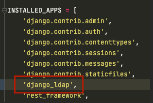
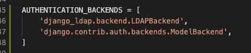

# Django LDAP

This library provides LDAP3 integration for Django, its purpose is to
wrap the ldap3 library and provide useful helpers for searching and
manipulating a given directory.

This library intends on becoming a full-fledged authentication backend
for Django in coming updates.

## Requirements
* Django 2.2+
* Python 3.7+

## Installation
1. Install the library
~~~sh
$ pip install django-ldap
~~~

2. Add "django_ldap" to your INSTALLED_APPS setting


3. Add "django_ldap.backend.LDAPBackend" as an AUTHENTICATION_BACKENDS i.e.

```python
AUTHENTICATION_BACKENDS = [
    # ...
    'django_ldap.backend.LDAPBackend',
    # ...
]
```


4. Add the following configuration items to your settings.py as a minimum
```LDAP_HOST = "LDAP://<LDAP_SERVER_HOSTNAME>:<LDAP_SERVER_PORT>"```
## Additional Configuration Parameters

| Key Name              | Value Default          | Description                                                                                                                                              | Sample                                             |
|:----------------------|:-----------------------|:---------------------------------------------------------------------------------------------------------------------------------------------------------|:---------------------------------------------------|
| LDAP_HOST             | "ldap://localhost:389" | LDAP Server FDQN                                                                                                                                         | `LDAP_HOST = "LDAP://localhost:389"`               |
| LDAP_TLS              | False                  | Whether to enable secure ldap (note, LDAP and appropriate port should be used in hostname i.e. 636)                                                      | `LDAP_TLS = False`                                 |
| LDAP_TLS_VALIDATE     | ssl.CERT_OPTIONAL      | If TLS is enabled then the relevant SSL verification code required (either via ssl enum or int)                                                          | `LDAP_TLS_VALIDATE = ssl.CERT_OPTIONAL`            |
| LDAP_TLS_VERSION      | ssl.PROTOCOL_TLSv1     | If TLS is enabled then the relevant TLS version must be provided                                                                                         | `LDAP_TLS_VERSION = False`                         |
| LDAP_BIND_USER_DN     | None                   | DN of Auth User (None for anonymous)                                                                                                                     | `LDAP_BIND_USER_DN = "cn=admin,dc=example,dc=com"` |
| LDAP_BIND_PASS        | None                   | Auth User Password (ignored if user DN is None)                                                                                                          | `LDAP_BIND_PASS = "Foo"`                           |
| LDAP_PAGE_SIZE        | 500                    | Number of elements to return per paged result                                                                                                            | `LDAP_PAGE_SIZE = 500`                             |
| LDAP_SEARCH_ROOT      | "dc=example,dc=com"    | LDAP tree root (Used for search when left as default)                                                                                                    | `LDAP_SEARCH_ROOT = "dc=example,dc=com"`           |
| LDAP_ENABLE_REF_CACHE | True                   | Enables Referral Cache                                                                                                                                   | `LDAP_ENABLE_REF_CACHE = True`                     |
| LDAP_SET_LDAP3_ARGS   | {}                     | Allows LDAP3 global parameters to be updated (see [LDAP3 Global Config](https://ldap3.readthedocs.io/en/latest/installation.html#global-configuration) ) | `LDAP_SET_LDAP3_ARGS = {'SOCKET_SIZE': 4096}`      |
| LDAP_AUTH_MODE        | None                   | NTLM for Active Directory, SASL for external cert or kerberos, leave as None for other cases, ldap3 will auto choose SIMPLE or ANONYMOUS auth            | `LDAP_AUTH_MODE = NTLM`                            |

## How to contribute
TBD

ensure black formatter is used